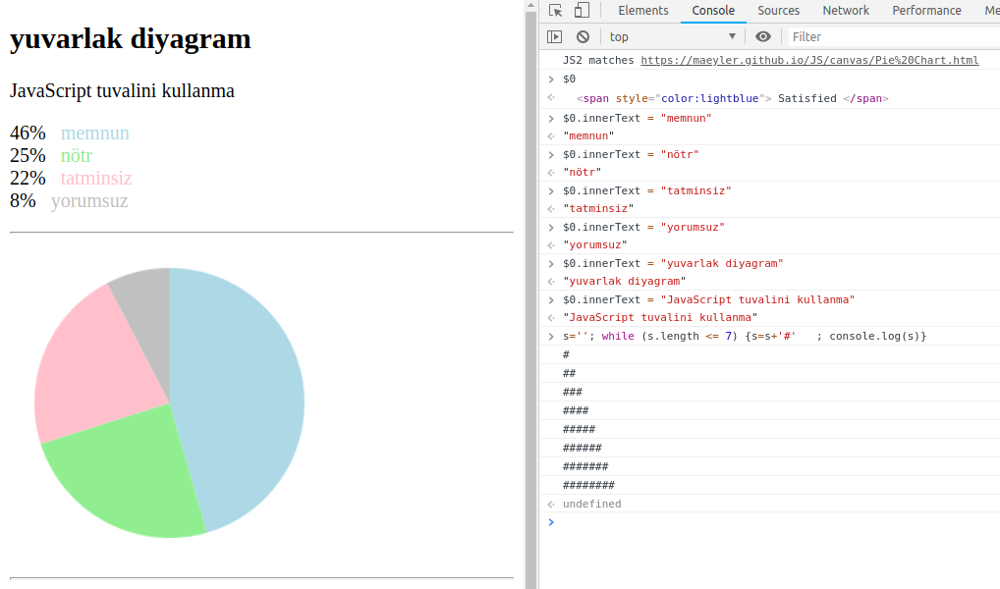

# advancedProgramming

## *CLASSWORKS*

[CW2 - Counting](./Classworks/CW2/Counting.html)

[CW2 - Temperature Convertor](./Classworks/CW2/TemperatureConvertor.html)

[CW3 - Data Analysis](./Classworks/CW2/c4_data.html)